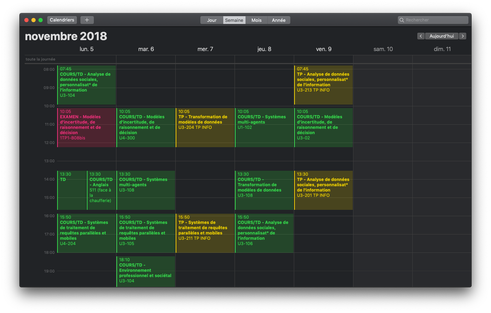

# celcat2ics
Convert  Paul Sabatier University timetables to ICS files

Access via **http://celcat2ics.clementbosc.fr?formation=[formation_id]&year=2018** with `formation_id` the ID of the formation in UPS Celcat website (ResourceName param over there)

Parameters | Usage | Exemple
---------- | ----- | -------
`formation` | ID of the formation in UPS Celcat website (ResourceName param over there). Can also be a list of Apogee codes | `?formation=formation_EIINDE_s1_TDA1`
`year` | Year to display, default is current year | `&year=2018`
`filtre_yes` | Type of the event to be included | `&filtre_yes=TD&filtre_yes=COURS` to display just the TD and the COURS events
`filtre_no` | Type of the event to NOT be included | `&filtre_no=TD` to display all the events exept TD events
`filtre_group` | Display only the group specified | `&filtre_group=M2 INF-DC` to display only events from M2 INF-DC group
`type` | Type of scrping : `module` for Apogee codes or `group` for class groups. Default is `group` | 

For `filtre_yes` and `filtre_no` parameters the possible event's type are : CONFERENCE, COURS/TD, TP, REUNION / RENCONTRE, TP NON ENCADRÉ, COURS, TD, SOUTIEN, EXAMEN

### For example
If the URL of your timetable in UPS's website is https://edt.univ-tlse3.fr/calendar/default.aspx?View=week&Type=group&ResourceName=formation_EIINDE_s1_TDA1, then the ICS file equivalent can be found here http://celcat2ics.clementbosc.fr?formation=formation_EIINDE_s1_TDA1&year=2018.

